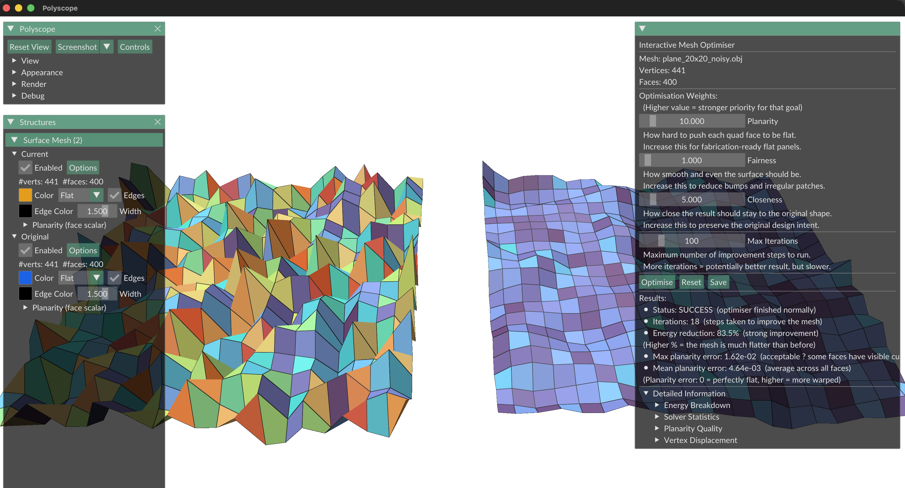

# PQ Mesh Optimisation Tool - Still in draft

**Real-Time Planar Quad (PQ) Mesh Optimisation and Visualisation Tool for Designing Developable Surfaces**

[](https://www.python.org/downloads/)
[](LICENSE)
[](https://github.com/psf/black)
[](https://github.com/nabiljefferson98/pq-mesh-optimisation/actions/workflows/ci.yml)
[](https://codecov.io/gh/nabiljefferson98/pq-mesh-optimisation)

A computational geometry tool for optimising quad meshes to achieve planar faces, enabling fabrication of architectural surfaces from flat panels. Implements SVD-based planarity formulation with L-BFGS-B optimisation.


*Before (left) and after (right) optimisation with planarity heatmap*

---

## 🎯 Features

- **✨ Planar Quad Optimisation**: Reduces face planarity deviation by >96× (average 96.4% improvement)
- **🚀 Hardware Acceleration**: Automatic backend detection for NVIDIA GPU (`cupy`), Parallel CPU (`numba`), and Baseline CPU (`numpy`)
- **⚡ Interactive Performance**: Optimises typical meshes (100-400 faces) in <2 seconds
- **🎨 Real-Time Visualisation**: Side-by-side comparison with planarity heatmaps using Polyscope
- **🎛️ Interactive UI**: Adjustable weight parameters with live optimisation
- **📊 Comprehensive Analysis**: Built-in benchmarking, convergence tracking, and sensitivity analysis
- **🧪 Robust Testing**: 229 tests, 0 failures, 1 skipped (GUI-only); ≥81% coverage (excl. GUI); 0 flake8/bandit/mypy violations
- **🔒 Security & Robustness**: Path-traversal protection, NaN/Inf guards in energy/gradient, atomic DXF/SVG writes, input sanitisation
- **🧪 Robust Testing**: 229 tests, 0 failures, 1 skipped (GUI-only); ≥79% coverage (excl. GUI); 0 flake8/bandit/mypy violations
- **🔒 Security & Robustness**: Path-traversal protection, NaN/Inf guards in energy/gradient, atomic DXF/SVG writes, input sanitisation, active return-type contract assertions in optimiser
- **📈 Scalable**: O(n^1.27) complexity; practical ceiling ~5,625 faces (75×75 grid, ~80 s)
- **🏗️ CI/CD Pipeline**: GitHub Actions matrix (Ubuntu + macOS, Python 3.10–3.12) with type checking, security scanning, and Codecov
- **🔧 Two-Stage Optimisation**: Rapid planarity pass followed by balanced refinement for improved convergence on complex meshes

---

## 🚀 Quick Start

### Installation

```bash
# Clone repository
git clone https://github.com/<your-username>/pq-mesh-optimisation.git
cd pq-mesh-optimisation

# Create virtual environment
python3 -m venv .venv
source .venv/bin/activate  # On Windows: .venv\Scripts\activate

 # Install dependencies (includes optional hardware-acceleration packages,  see requirements.txt)
pip install -r requirements.txt

 # Note: GPU/Numba packages in requirements.txt may not be available on all platforms.
 # For CPU-only builds, you can install requirements_without_CUDA.txt instead.
pip install -r requirements_without_CUDA.txt


# Verify installation
python -m pytest tests/ -v  # Verify: Total 241 passed or skipped, depending on your setup
```

### Interactive Optimisation

```bash
# Launch interactive viewer with parameter sliders
# (runs with cylinder_10x8.obj by default if no argument given)
python src/visualisation/interactive_optimisation.py

# With a specific mesh
python src/visualisation/interactive_optimisation.py data/input/generated/plane_5x5_noisy.obj

# With conical constraint and custom iteration budget
python src/visualisation/interactive_optimisation.py data/input/generated/sphere_cap_10x8.obj

# If you want to force a specific backend are as follows (runs with cylinder_10x8.obj by default if no argument given):

# ── NumPy baseline (your Mac, or force on PC) ────────────────────────────────
PQ_BACKEND=numpy python src/visualisation/interactive_optimisation.py

# ── Numba parallel CPU (PC — triggers warmup on first run) ───────────────────
PQ_BACKEND=numba python src/visualisation/interactive_optimisation.py

# ── CuPy GPU (PC RTX 3070 — skip warmup, no Numba used) ─────────────────────
PQ_BACKEND=cupy python src/visualisation/interactive_optimisation.py

# ── With a specific mesh file ────────────────────────────────────────────────
PQ_BACKEND=numba python src/visualisation/interactive_optimisation.py data/input/generated/plane5x5noisy.obj

```

---

## 📂 Project Structure

```
pq-mesh-optimisation/
├── README.md                         # Project overview and quick-start
├── src/                              # Core library — import only, do not run directly
│   ├── README.md                     # Internal library documentation
│   ├── backends.py                  # Hardware backend detection (GPU/Parallel CPU)
│   ├── core/
│   │   └── mesh.py                  # QuadMesh data structure; lazy scatter matrix
│   ├── optimisation/
│   │   ├── energy_terms.py          # Planarity (SVD), fairness, closeness, angle-balance energies
│   │   ├── mesh_geometry.py         # Geometric utilities (face planarity, conical imbalance)
│   │   ├── gradients.py             # Analytical gradient ∂E/∂V for all energy terms
│   │   └── optimiser.py             # L-BFGS-B wrapper; OptimisationConfig/Result dataclasses
│   ├── io/
│   │   ├── obj_handler.py           # Wavefront OBJ reader/writer (preserves quads)
│   │   └── panel_exporter.py        # Export flat panels to DXF and SVG
│   ├── preprocessing/
│   │   └── preprocessor.py          # Normalisation, degenerate-face detection, weight suggestions
│   └── visualisation/
│       └── interactive_optimisation.py  # Polyscope 3D viewer; planarity & conical heatmaps
├── scripts/                          # Research and analysis pipeline
│   ├── mesh_generation/
│   │   └── generate_test_meshes.py   # Curved surface test mesh generation
│   ├── benchmarking/
│   │   ├── benchmark_optimisation.py # Performance timing across mesh sizes
│   │   └── stress_test.py            # Upper mesh-size limit with RAM profiling
│   ├── diagnostics/
│   │   ├── energy_analysis.py        # Energy component breakdown and weight recommendations
│   │   └── gradient_verification.py  # Analytical vs numerical gradient check
│   └── analysis/
│       ├── analyse_results.py        # Statistics, complexity, LaTeX/CSV tables
│       ├── plot_convergence.py       # Convergence and scaling plots
│       ├── plot_sensitivity.py       # Pareto frontier and weight heatmaps
│       └── sensitivity_sweep.py      # 80-config weight sweep, Pareto analysis
├── tests/                            # 205 tests, 0 failures (≥79% coverage excl. GUI)
│   ├── test_mesh.py
│   ├── test_quad_topology_preservation.py
│   ├── test_geometry.py
│   ├── test_energy_terms.py
│   ├── test_gradients.py
│   ├── test_gradients_extended.py
│   ├── test_optimiser.py
│   ├── test_obj_handler.py
│   ├── test_obj_handler_extended.py
│   ├── test_panel_exporter.py
│   ├── test_preprocessor.py
│   ├── test_scalability.py
│   ├── test_error_handling.py
│   ├── test_coverage_extended.py
│   ├── test_robustness.py
│   ├── test_backends.py              # Backend detection and fallback logic
│   ├── test_numerical_equivalence.py # Numerical consistency across backends
│   ├── test_vertex_face_ids.py       # Vertex-to-face topology cache correctness
│   └── test_quad_loading.py          # igl quad-vs-triangle loading comparison
├── data/
│   ├── input/
│   │   ├── generated/                # Synthetic noisy plane grids + curved surfaces (OBJ)
│   │   ├── benchmark/                # Keenan Crane model (spot_quadrangulated.obj)
│   │   ├── cad/                      # ABC Dataset download instructions
│   │   └── thingi10k/                # Thingi10K download instructions
│   └── output/
│       ├── optimised_meshes/         # Saved .obj results + convergence plots
│       ├── panels/                   # DXF and SVG fabrication exports
│       ├── benchmarks/               # JSON performance data + analysis plots
│       ├── weight_sensitivity/       # Weight sweep JSON, plots, report
│       └── tables/                   # LaTeX and CSV dissertation tables
├── docs/
│   ├── README.md                     # Documentation overview
│   ├── architecture.md               # System architecture: modules, data flow, design decisions
│   ├── methodology.md                # Mathematical methodology: energy formulation, gradients, algorithm
│   ├── results.md                    # Results and analysis
│   ├── LOGBOOK.md                    # Weekly progress log
│   ├── images/                       # Figures and comparison screenshots
│   └── dissertation/                 # LaTeX dissertation source
│       ├── main.tex                  # Top-level document (\input all chapters)
│       ├── chapter4_results.tex      # Chapter 4: Results
│       ├── chapter5_discussion.tex   # Chapter 5: Discussion
│       └── figures.tex               # \includegraphics calls for all dissertation figures
├── .github/
│   └── workflows/ci.yml              # GitHub Actions: lint, test matrix, type-check, security
├── .pre-commit-config.yaml           # Pre-commit hooks (black, isort, flake8, bandit)
├── Makefile                          # Developer quality pipeline
├── pyproject.toml                    # Project config (isort, flake8, coverage)
├── requirements.txt                  # Python dependencies
├── requirements_without_CUDA.txt     # Python dependencies without CUDA packages
├── conftest.py                       # Pytest configuration / shared fixtures
└── LICENSE
```


---

## 🔧 Technical Details

### Algorithm Overview

The tool implements a **constrained nonlinear optimisation** approach:

1. **Energy Formulation** (Section 3.3 of dissertation)
    - **Planarity Energy**: SVD-based measure of face non-planarity
    - **Fairness Energy**: Discrete Laplacian for mesh smoothness
    - **Closeness Energy**: Deviation from original design
2. **Optimisation Method** (Section 3.4)
    - **Algorithm**: L-BFGS-B (Limited-memory BFGS with bounds)
    - **Gradients**: Analytical (closed-form derivation for all three energy terms)
    - **Convergence**: ftol=10⁻⁹, gtol=10⁻⁵, maxcor=20, maxls=40
3. **Complexity**
    - **Time**: O(n^1.27) where n = number of vertices (NumPy)
    - **Speedup**: Up to 10× with CUDA GPU acceleration (`cupy`) on 10k+ vertex meshes
    - **Memory**: O(n) via limited-memory Hessian approximation
    - **Iterations**: Typically 9-13 iterations to convergence

### CLI Output

When `verbose=True` (the default), the optimiser prints three sections:

```
======================================================================
MESH OPTIMISATION — STARTING
======================================================================
Mesh loaded: 121 corner points, 100 panels
Priority settings — Flatness: 100.0, Smoothness: 1.0, Shape fidelity: 10.0

Starting scores (lower is better — the optimiser will reduce these):
  Overall combined score:     9823.1234
  Panel flatness score:       98.1234  (how uneven the panels are)
  Surface smoothness score:   0.1234   (how bumpy the surface is)
  Shape fidelity score:       0.0000   (how far vertices have moved from the original design)
======================================================================
Progress will be printed every 10 improvement steps.
Each line shows: step number, combined score, rate of change (lower = nearly done), and time elapsed.

Step   10: score = 141.03,  rate of change = 0.6722,  time elapsed = 1.75s
           (technical: iteration 10,  energy E = 1.410300e+02,  || gradient E || = 6.7220e-04)
...

======================================================================
OPTIMISATION COMPLETE — RESULTS SUMMARY
======================================================================
Result: FINISHED SUCCESSFULLY — the optimiser found the best solution it could
(Technical message from solver: CONVERGENCE: NORM_OF_PROJECTED_GRADIENT_<=_PGTOL)

Overall score (lower = flatter, smoother, closer to original):
  Score at the start:            9823.1234
  Score at the end:              1.0234
  Total improvement:             99.99%

How hard did the optimiser work?
  Improvement steps taken:       12
  Times it checked the score:    36
  Times it checked the direction:12
  Total time:                    1.09 seconds

Per-goal score breakdown (how each individual goal changed):
  Panel flatness    : 98.1234 to 0.0001  (99.9% better)
  Surface smoothness: 0.1234  to 0.1187  (3.8% better)
  Shape fidelity    : 0.0000  -> still 0  (nothing to improve here)
======================================================================
```

### Dependencies

- **NumPy** (≥1.24): Numerical computation and linear algebra
- **SciPy** (≥1.11): L-BFGS-B optimiser
- **Polyscope** (≥2.2): 3D mesh visualisation
- **Matplotlib** (≥3.7): Plotting and convergence analysis
- **pytest** (≥7.4): Testing framework

Full dependency list: [`requirements.txt`](requirements.txt)

---

## 📊 Performance Benchmarks

| Mesh Size | Vertices | Faces | Time (s) | Energy Reduction | Status |
| :-- | :-- | :-- | :-- | :-- | :-- |
| 3×3 | 16 | 9 | 0.08 | 9629.7% | ✓ |
| 5×5 | 36 | 25 | 0.36 | 9668.1% | ✓ |
| 10×10 | 121 | 100 | 1.09 | 9675.6% | ✓ |
| 20×20 | 441 | 400 | 5.31 | 9542.9% | ✓ |
| 30×30 | 961 | 900 | 11.37 | 82.9% | ✓ |
| 40×40 | 1,681 | 1,600 | 21.70 | 82.9% | ✓ |
| 50×50 | 2,601 | 2,500 | 27.17 | 83.0% | ✓ |
| 75×75 | 5,776 | 5,625 | 79.63 | 83.2% | ✓ |

**Scalability**: T(n) ≈ O(n^1.27) with R² = 1.000
**Speedup**: 2.3–2.4× over original Python loop (vectorised SVD + sparse scatter matrix)

See [`data/output/benchmarks/`](data/output/benchmarks/) for detailed performance data.

---

## 🧪 Testing

Run the test suite:

```bash
# All tests
pytest tests/ -v

# Specific test categories
pytest tests/test_optimiser.py -v          # Optimisation tests
pytest tests/test_gradients.py -v          # Gradient verification
pytest tests/test_scalability.py -v        # Scalability tests
pytest tests/test_robustness.py -v         # Robustness and security regression tests
pytest tests/test_backends.py -v           # Hardware backend tests
pytest tests/test_numerical_equivalence.py -v  # Numba vs NumPy equivalence (229 total incl. 10 planarity gradient tests)

# With coverage report
pytest tests/ --cov=src --cov-report=html

# Full quality pipeline (format, lint, type, security, test)
make check

# Pre-commit hooks (black, isort, flake8, bandit)
pre-commit run --all-files
```

**Test Results**: 229 passed, 1 skipped | **Coverage**: ≥81% (excluding GUI module) | **0 flake8/bandit/mypy violations**

---

## 📖 Documentation

- **[Architecture](docs/architecture.md)**: System design — module reference, data flow, design decisions
- **[Methodology](docs/methodology.md)**: Mathematical derivations — energy formulation, analytical gradients, optimisation algorithm
- **[Logbook](docs/LOGBOOK.md)**: Weekly progress log
- **[Dissertation LaTeX](docs/dissertation/)**: Chapter source files and figure includes

---

## 🎓 Academic Context

This tool was developed as part of an undergraduate dissertation at the **University of Leeds, School of Computing** (2025/26).

- **Supervisor**: Professor Hamish Carr
- **Student**: Muhammad Nabil Bin Muhammad Saiful Wong
- **Project Title**: Real-Time Planar Quad Mesh Optimisation for Designing Developable Surfaces

**Key References**:

1. Liu, Y., Pottmann, H., et al. (2006). *Geometric modeling with conical meshes and developable surfaces*. ACM TOG, 25(3), 681–689.
2. Pottmann, H., et al. (2007). *Architectural geometry*. Computers \& Graphics, 31(6), 785–800.
3. Nocedal, J., \& Wright, S. (2006). *Numerical Optimization* (2nd ed.). Springer.

See dissertation for complete bibliography.

---

## 🤝 Contributing

Contributions welcome! Please follow these guidelines:

1. Fork the repository
2. Create a feature branch (`git checkout -b feature/AmazingFeature`)
3. Follow code style (PEP 8, use `black` formatter)
4. Add tests for new functionality
5. Ensure all tests pass (`pytest tests/`)
6. Commit with clear messages (`git commit -m 'Add amazing feature'`)
7. Push to branch (`git push origin feature/AmazingFeature`)
8. Open a Pull Request

---

## 📄 License

This project is licensed under the **MIT License** — see [LICENSE](LICENSE) file for details.

---

## 🙏 Acknowledgements

- **Professor Hamish Carr** — Academic supervision and guidance
- **Dr Sebastian Ordyniak** - Academic Assessor and guidance
- **Helmut Pottmann et al.** — Foundational research on architectural geometry
- **SciPy Contributors** — Excellent optimisation library
- **Polyscope Team** — Beautiful 3D visualisation framework

---

## 📧 Contact

**Author**: Muhammad Nabil Bin Muhammad Saiful Wong
**Email**: sc23mnbm@leeds.ac.uk
**GitHub**: [@nabiljefferson98](https://github.com/nabiljefferson98)

**University of Leeds**
School of Computing
Leeds LS2 9JT, United Kingdom

---

## 📈 Roadmap

Future enhancements under consideration:

- [x] Numba-parallel planarity SVD energy kernel (CPU acceleration) ✓
- [x] Numba-parallel planarity gradient kernel `_planarity_gradient_contributions_numba` ✓
- [ ] Full GPU acceleration for large meshes (>10,000 vertices)
- [x] Conical mesh optimisation — two-stage with angle-balance constraint ✓
- [ ] Interactive mesh editing with constraint preservation
- [x] Export to fabrication formats (DXF + SVG) ✓
- [ ] Web-based version using WebAssembly
- [ ] Integration with Rhino/Grasshopper

---

## 🐛 Known Issues

- **macOS OpenGL**: Polyscope requires OpenGL 3.3+; update drivers if issues occur
- **Windows WSL**: GUI requires X server (e.g., VcXsrv)
- **Very large meshes (>10,000 vertices)**: Runtime exceeds ~120 s; both the Numba planarity energy kernel and gradient kernel (`_planarity_gradient_contributions_numba`) are now implemented (15 Mar 2026). CuPy GPU path remains the target for very large meshes

Report bugs: [GitHub Issues](https://github.com/nabiljefferson98/pq-mesh-optimisation/issues)

---

*Last updated: 03 April 2026*
